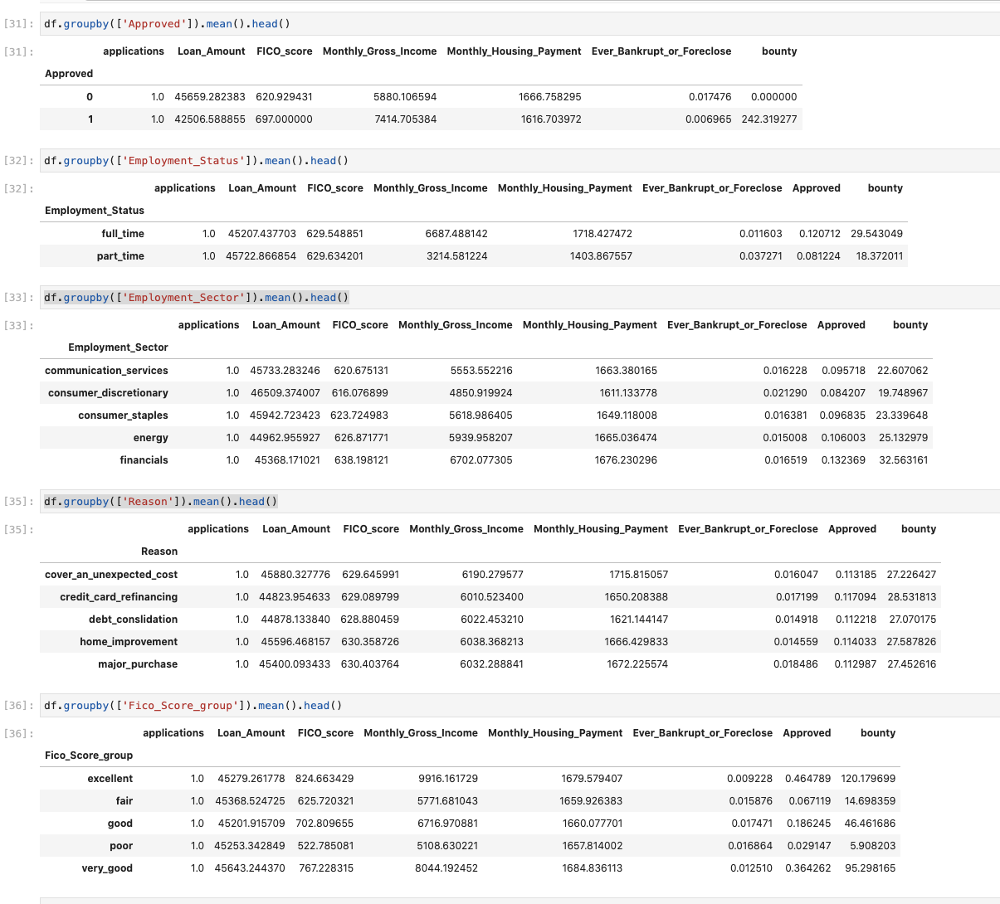
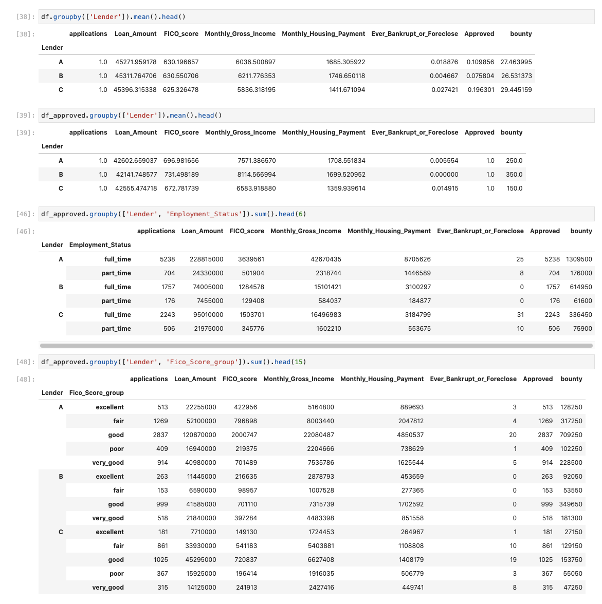
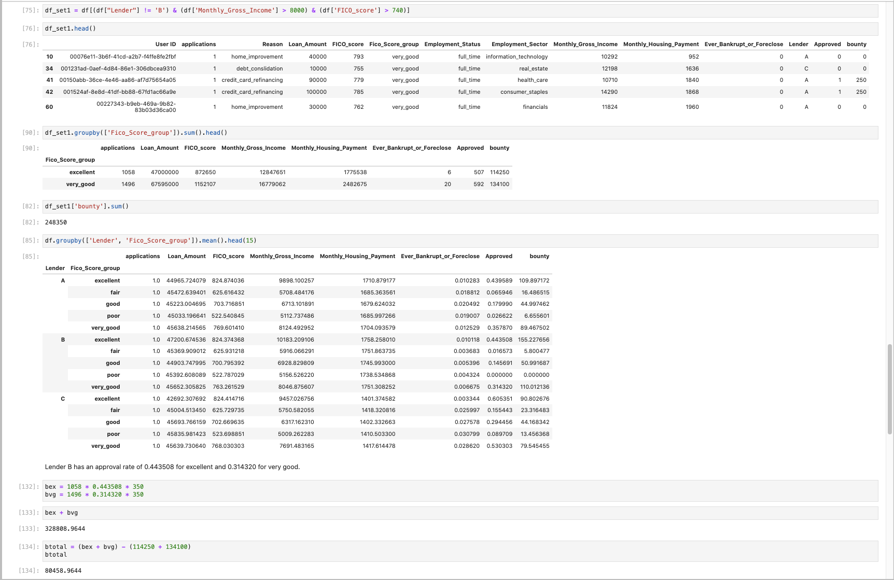

# Red Ventures Technical Case Assessment

## Question 1 
### Which variables are the most helpful in understanding if a customer is going to be approved or denied for a loan? Are there certain variables that are not useful to collect?

Grouping the data to assess first the numerical then the categorical and ordinal associated variables, it is clear that some variables hold a correlation with approval rate, whereas some variables do not hold such a correlation. Of the variables: FICO Score, FICO Score Category, Monthly Gross Income, Employment Status, and Ever Bankrupt/Foreclose have a strong correlation with the approval rate of the loan. On the other hand, the variables: Loan Amount, Monthly Housing Payment, Employment Sector, and Reason do not have any noticeable correlation with the approval rate of the loan. 

Work for Question 1:

## Question 2 
### What is each Lender's average approval rate? How does their revenue per approval differ? Are there any clear differences between the three different Lenders on what type of customers they approve?

Lender A has an average approval rate of 10.99%, Lender B has an average approval rate of 7.58%, and Lender C has an average approval rate of 19.63%. 

Lender A has a revenue per approval of 250, Lender B has a revenue per approval of 350, and Lender C has a revenue per approval of 150.

There are some clear differences between the type of customers each lender approves. Lender B tends to approve those with a higher FICO score, and does not approve any applicant with a FICO Category of "Poor" whatsoever, nor do they approve applicants who have ever bankrupted or forclosed. Lender B also approves those with a higher monthly income, whereas Lender C approves those with a lower monthly income. Lender C tends to approve applicants with a lower monthly housing payment than the other lenders as well. 

Work for Question 2:

## Question 3 
### Are there groups of customers that would be a better fit for a different lender? How much incremental revenue could we have made if we matched certain groups of customers more appropriately?

There are some groups that are very visibly a better fit for a different lender. Customers that make an income in excess of $8000 with a FICO score category of very good or excellent that applied for Lender A or C and did not have a bankruptcy or foreclosure would be a better fit for Lender B. Customers with a fair or poor credit score that applied for Lender B or A would be a better fit for Lender C. 

There are some other groups that would fit better with a different lender, such as applicants with a very good or excellent credit score and a bankrupt/forclose that applied to Lender B instead of Lender A, but these groups are not significant enough to make much of an impact on revenue.

Taking into account for average approval rate, moving the first aforementioned category increases the revenue by roungly $80,459. Moving the second category increases the revenue by roughly $468,210. 

In total the incremental increased revenue would be around $548,669.

Work for Question 3:

